# Tugas 8 - Pertemuan 9

Jehian H1D022006 Shift C->D

## Feat

- Login pakai username & password
- Home u/ lihat daftar mahasiswa
- Tambah data mahasiswa
- Edit data mahasiswa
- Hapus data mahasiswa pakai konfirmasi
- Validasi input
- Alert & Toast notification
- Modal & Icon

## Screenshot & Penjelasan

### 1. Login Page

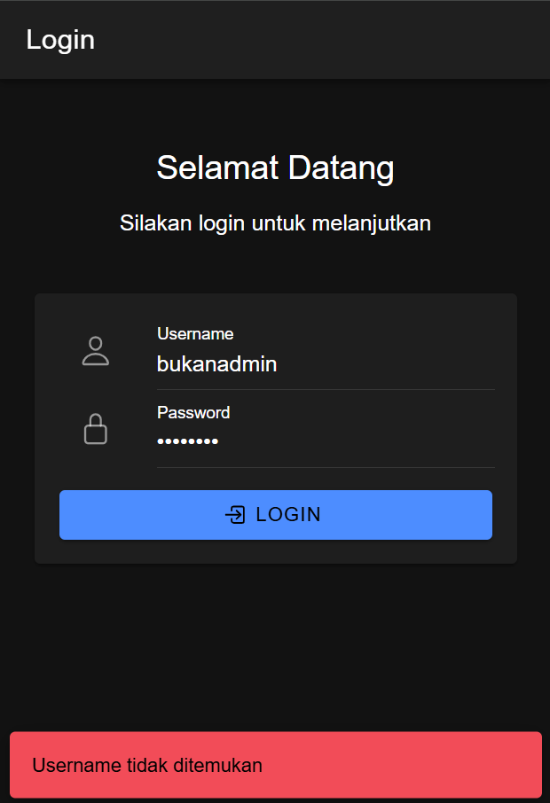
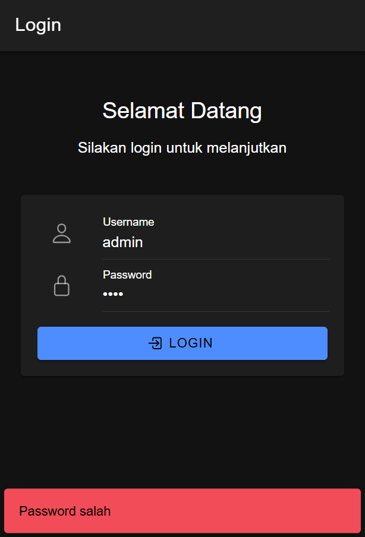

- Validasi username & password
- Password dihash u/ keamanan
- Menyimpan data user di localStorage setelah login berhasil

### 2. Mahasiswa Page (Read)

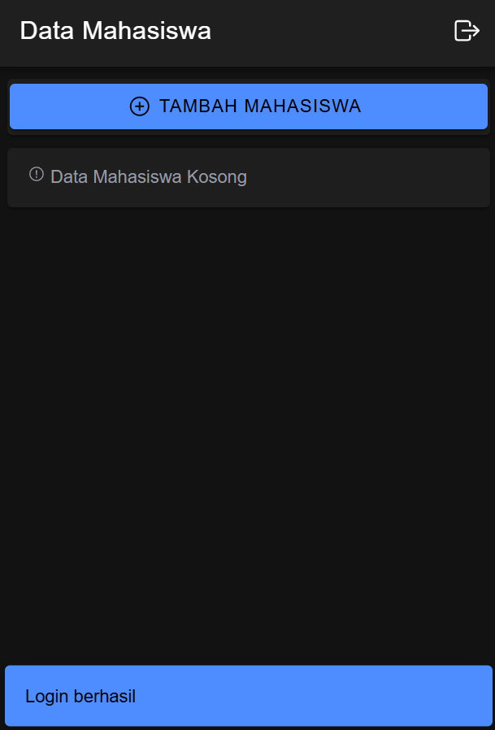
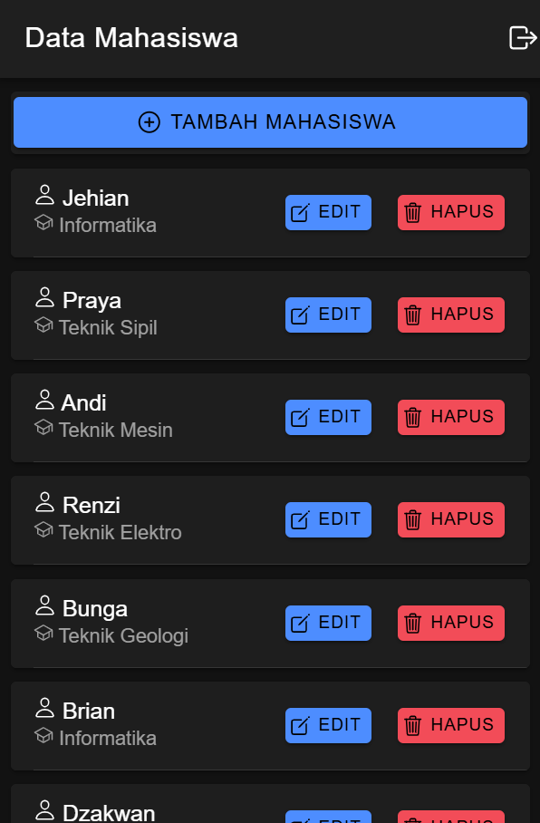

- Menampilkan daftar mahasiswa dalam bentuk card
- Setiap card menampilkan nama & jurusan mahasiswa
- Terdapat tombol u/ tambah, edit, dan hapus data
- Tombol logout di pojok kanan atas

### 3. Tambah Data (Create)

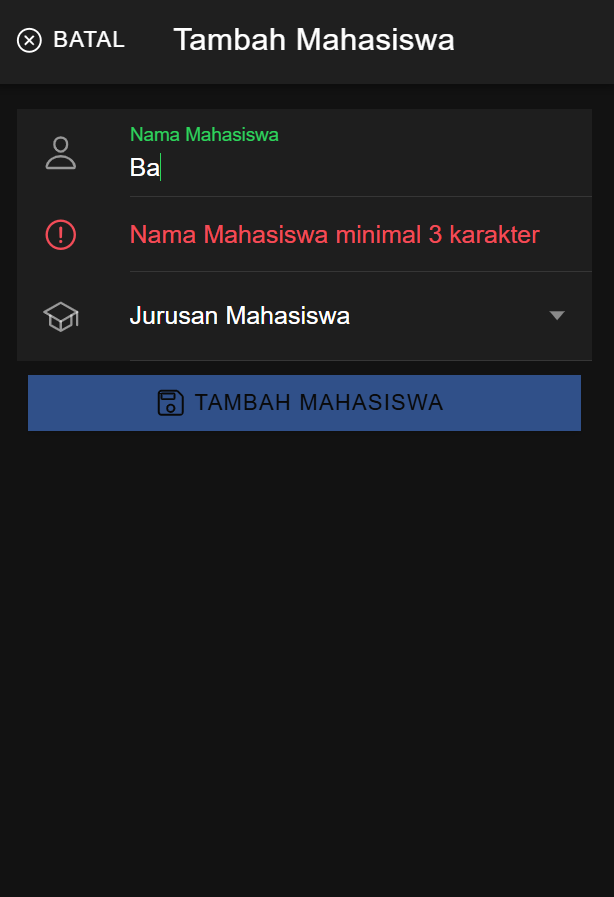
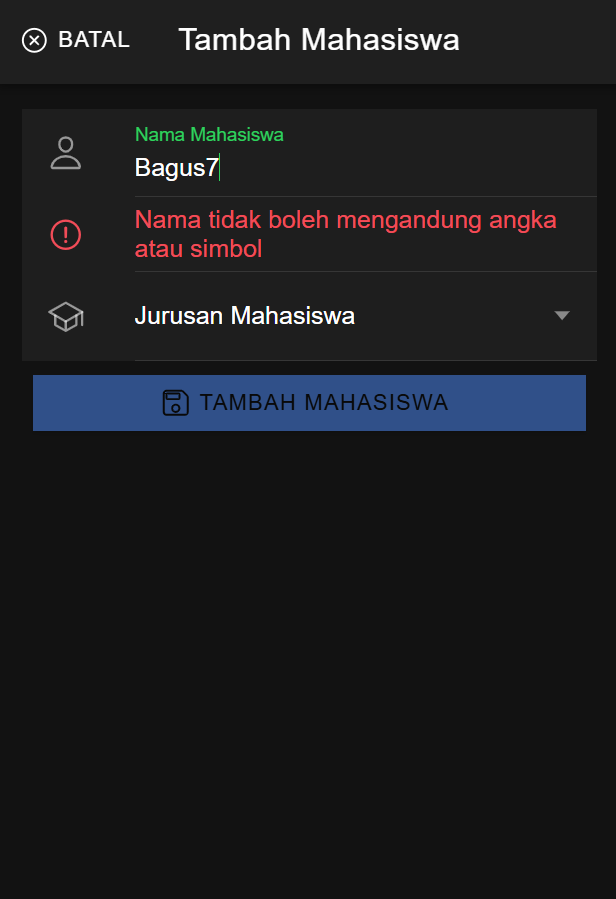
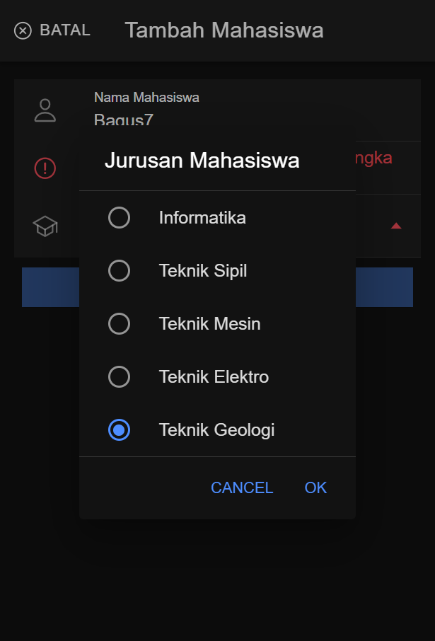
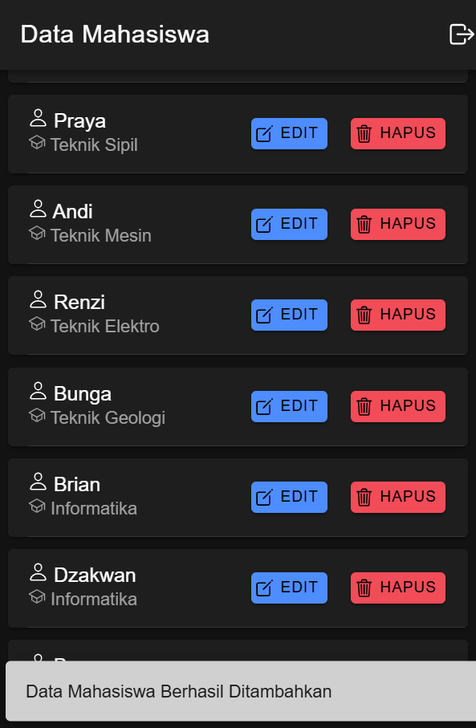

- Modal u/ menambah data mahasiswa baru
- Validasi input nama (min. 3 char, hanya huruf)
- Dropdown u/ pilihan jurusan
- Tombol simpan akan aktif jika semua input valid

### 4. Edit Data (Update)

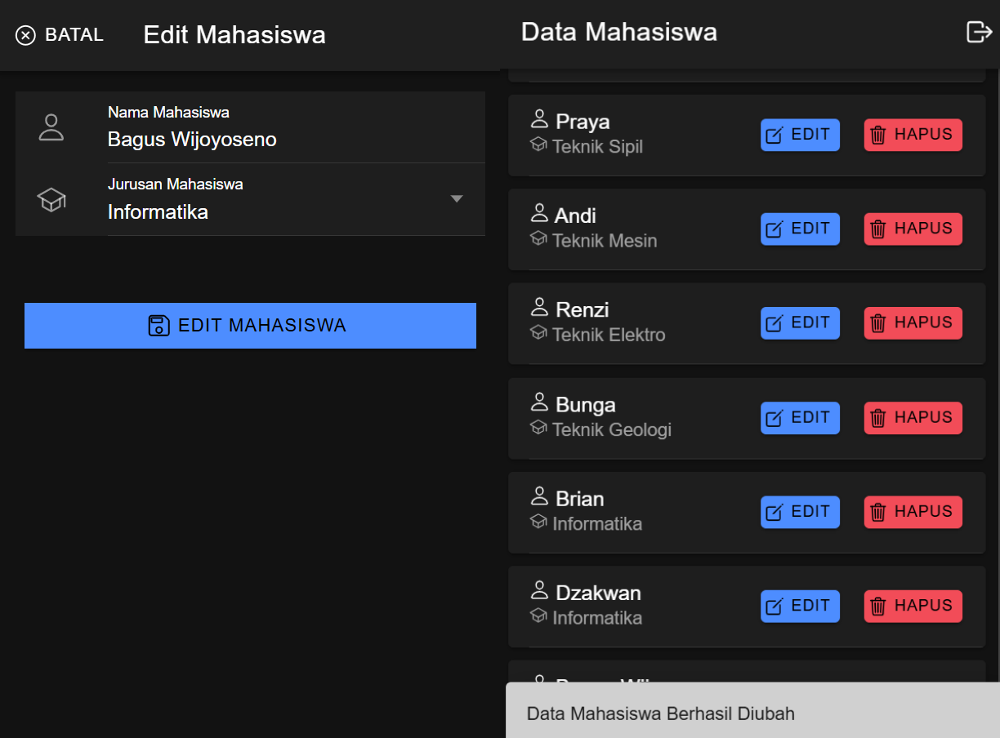
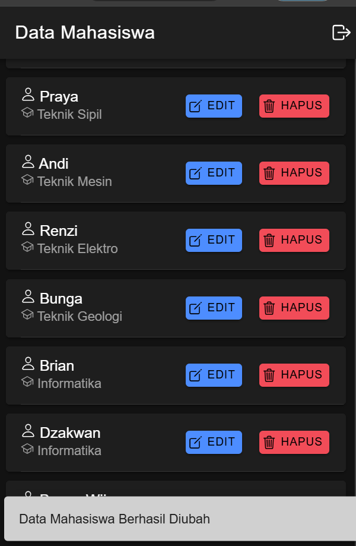

- Modal u/ mengubah data mahasiswa
- Form auto fill dengan data yang mau diedit
- Validasi input sama seperti form tambah
- Perubahan akan tersimpan setelah klik tombol edit

### 5. Hapus Data (Delete)

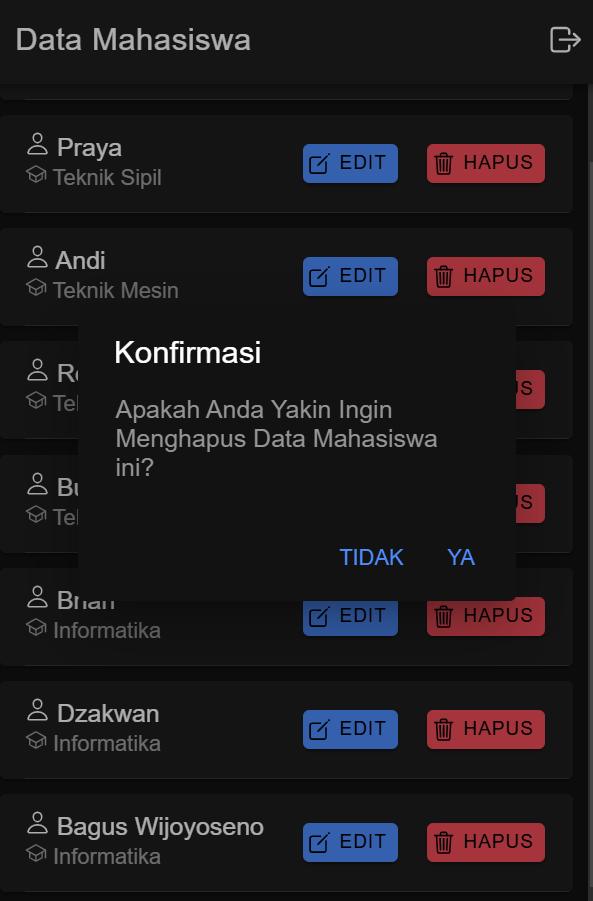
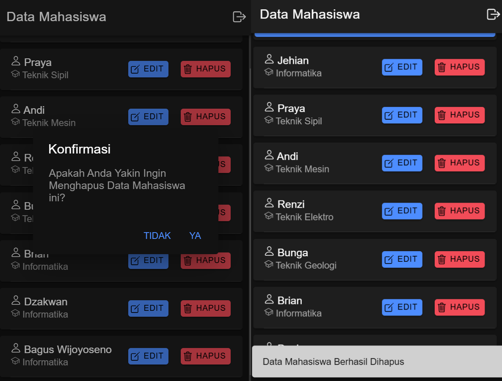

- Konfirmasi dialog sebelum hapus data
- Opsi u/ batal atau lanjut hapus
- Notifikasi toast setelah data berhasil dihapus

## Keamanan

1. Password Hashing
   - Menggunakan PHP password_hash() untuk enkripsi password
   - Verifikasi menggunakan password_verify()

2. Auth Guard
   - Proteksi routing u/ page yang membutuhkan auth
   - Redirect ke login jika belum auth

3. Input Validation
   - Validasi di sisi client = Angular
   - Validasi di sisi server = PHP
   - Pencegahan SQL injection dengan mysqli_real_escape_string

## DB

### Tabel mahasiswa
```sql
CREATE TABLE mahasiswa (
  id int PRIMARY KEY AUTO_INCREMENT,
  nama varchar(255) NOT NULL,
  jurusan varchar(255) NOT NULL
);
```

### Tabel users
```sql
CREATE TABLE users (
  id int PRIMARY KEY AUTO_INCREMENT,
  username varchar(255) NOT NULL UNIQUE,
  password varchar(255) NOT NULL
);
```

## Endpoints

1. Login
   - URL: `/login.php`
   - Method: POST
   - Data: username, password

2. Tampil Data
   - URL: `/tampil.php`
   - Method: GET

3. Tambah Data
   - URL: `/tambah.php`
   - Method: POST
   - Data: nama, jurusan

4. Edit Data
   - URL: `/edit.php`
   - Method: PUT
   - Data: id, nama, jurusan

5. Hapus Data
   - URL: `/hapus.php`
   - Method: DELETE
   - Parameter: id

## Setup

1. Clone repo
2. Import db dari file `db.sql`
3. Sesuaikan konfigurasi di `koneksi.php`
4. Run `generate_password.php` untuk membuat user default
5. Run aplikasi dengan `ionic s`

## User Default

- Username: admin
- Password: admin123